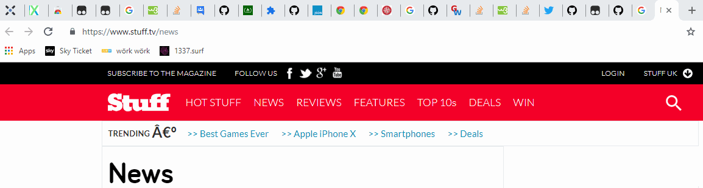

# wEhAvECoOkiEs

A bit of javascript for feeding Tampermonkey to get rid of those "Please accept that we use cookies" popups  

Will look like this:

## Usage:
* just install it & let it run while browsing, enjoy! ツ
  
## Notes:
* If you find popups that are not detected yet, feel free to message me on here, i'll work on them

## Installation:  
1. Get Tampermonkey  
https://chrome.google.com/webstore/detail/tampermonkey/dhdgffkkebhmkfjojejmpbldmpobfkfo?hl=en
2. Add a new userscript
3. Paste the code from antipopup.js
4. Go to settings of the script
5. Make sure this looks the same for you:  

