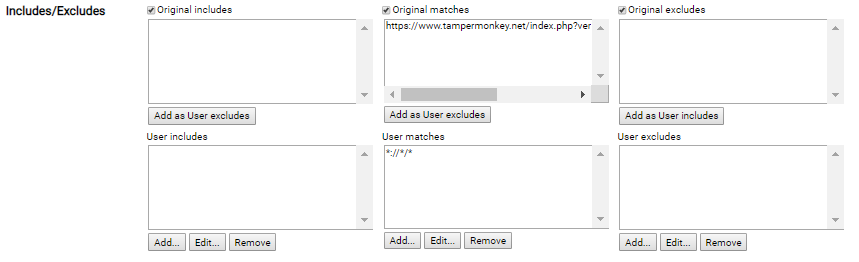

# wEhAvECoOkiEs
A bit of javascript for feeding Tampermonkey to get rid of those "Please accept that we use cookies" popups

## Installation:  
1. Get Tampermonkey  
https://chrome.google.com/webstore/detail/tampermonkey/dhdgffkkebhmkfjojejmpbldmpobfkfo?hl=en
2. Add a new userscript
3. Paste the code from antipopup.js
4. Go to settings of the script
5. Make sure this looks the same for you:  

